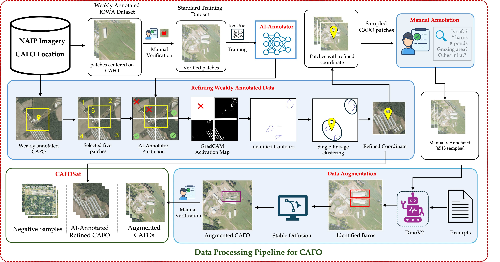

<h1 align="center">CAFOSat: A Strongly Annotated Dataset for Infrastructure-Aware CAFO Mapping Using High-Resolution Imagery</h1>
<p align="center">
  <a href="https://huggingface.co/datasets/oishee3003/CAFOSat">
    
    <br/>
  </a>
</p>





## 🗺️ CAFOSAT: Dataset Summary
🔗 CAFOSat is hosted on the Hugging Face Hub: https://huggingface.co/datasets/oishee3003/CAFOSat

🔍 To explore the dataset, its features, and to see an example dataloader: https://github.com/oishee-hoque/CAFOSat/tree/main/data_loader

CAFOSat is a large-scale, high-resolution dataset designed to support infrastructure-aware mapping of Concentrated Animal Feeding Operations (CAFOs) across the United States. The dataset spans **2,064 counties** and contains over **45,000 image patches** extracted from NAIP imagery, each at **833×833 pixels** with a **0.3-0.6m spatial resolution**.

## 📦 Key Features

- **Diverse Coverage**: Images span six major CAFO types and are sourced from a combination of **federal, state, and academic datasets**, ensuring diverse geographic and operational representation.
- **High-Quality Annotations**:
  - **Facility-Level Labels**: Each image patch includes a CAFO classification label and a bounding box localizing the CAFO infrastructure within the patch.
  - **Infrastructure-Level Labels**: Detailed manual annotations for structures such as barns, manure lagoons, feed storage, and more for ~3000 CAFO Location.
- **Synthetic Subset**: Includes a manually validated set of synthetic images to support testing of domain generalization and augmentation robustness. (~6500 Patches)
- **Hard Negatives**: Carefully curated negative samples that closely resemble CAFO environments but do not contain actual facilities — ideal for training discriminative models.(~23k Patches)


## 📁 Dataset Structure

```text
CAFOSat/
├── {state_filtered}
│   └── <patch_file>.tif
├── barn/
│   └── <patch_file>.tif
├── manure_pond/
│   └── <patch_file>.tif
├── others/
│   └── <patch_file>.tif
├── negative_sample/
│   └── <patch_file>.tif
├── CAFOSat.csv
```

#### 📝 Description

- `{state}_filtered/`: Original geolocation image patches organized by state, including refined geolocation image patches organized by state.
- `barn/manure_pond/others`: Synthetic data generated by augmentation techniques, categorized by infrastructure type.
- `negative_sample/`: Hard negative samples—image patches visually similar to CAFOs but containing no actual CAFOs.
- `cafosat.csv`: CSV files containing metadata for both real and augmented patches (e.g., geolocation, type, annotations, bounding box, weak geolocation, refined geolocation etc).


## 🛠️ Create Your Own Dataset or Reproduce CAFOSat

To create your own dataset using the CAFOSat annotation and processing pipeline, follow the guide in the repository below:

👉 [CAFOSat Data Processing Pipeline](https://github.com/oishee-hoque/CAFOSat/tree/main/data_prcosessing)

This includes:
- Geolocation Refinement
- Patch generation  
- Manual Verfication Setup  
- Annotate Infrastructure 
- Synthetic sample creation

🧠 Train your own classifier: [See classifier README](classifier/README.md)